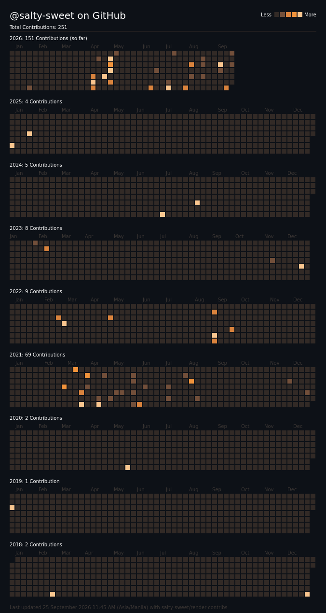

  
   
   
   
   
   
   
   
  <i>
    –—————————————————　　<a href="https://salty-sweet.github.io">saltysweet.github.io</a>　　—————————————————–
  </i>
   
   

<!--

  

  Because a bunch of icons isn't enough.
   
   
  <table align="center">
    <td>
      <b>Tools/Applications</b> 
      Visual Studio Code, Visual Studio, Adobe Photoshop, Adobe Illustrator, Canva, 
    </td>
  </table>

-->

  

  ✨ This contribution sheet was made using <a href="https://github.com/salty-sweet/render-contribs/">salty-sweet/render-contribs</a>! Check it out! ✨
   
   
   

